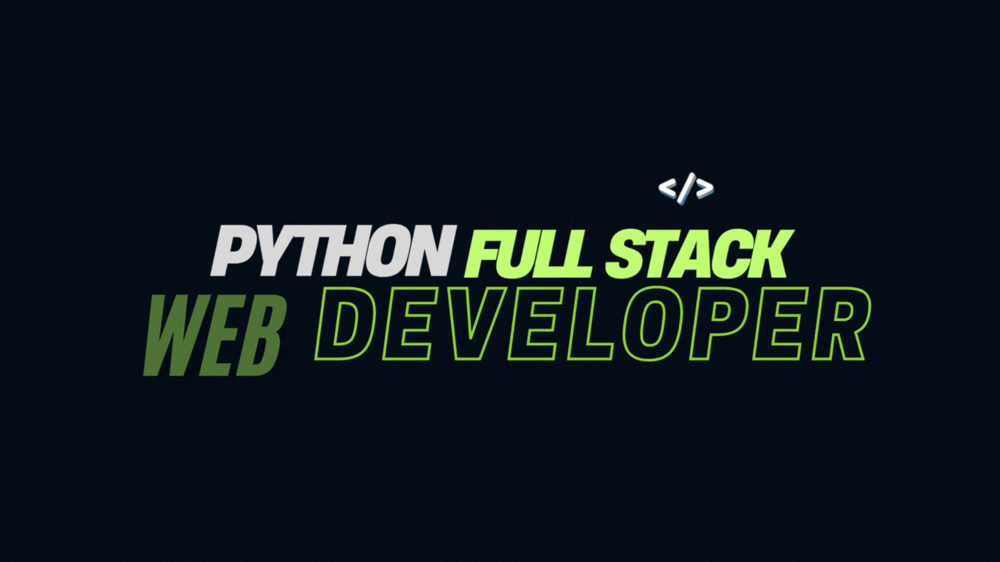

<table>
<tr>
<td align="left" width="70%" style="vertical-align: top; padding: 15px;">

<h1>💫👋 Hi, I’m Sonu Kumar</h1>

💻 I am a <b>Python Full Stack Web Developer</b> passionate about building modern, scalable, and efficient web applications.  
🌐 I work on both <b>Frontend (HTML, CSS, JavaScript)</b> and <b>Backend (Python, Django, Flask)</b>, creating seamless and interactive user experiences.  
🗄 I design and manage databases like <b>MySQL, PostgreSQL, and MongoDB</b> to build reliable, data-driven applications.  
⚡ I enjoy developing <b>REST APIs</b> and crafting solutions that are not only functional but also user-friendly and optimized.  
📚 I am continuously improving my skills in <b>Data Structures, Algorithms, and System Design</b> to become a stronger, more versatile developer.  
🚀 My goal is to transform ideas into real-world projects that are fast, scalable, and impactful, making a difference through code.

</td>

<td align="center" width="30%" style="vertical-align: middle; padding: 15px;">
  
<h2>💗 SPONSOR ME</h2>

  

</td>
</tr>
</table>

## 🌐 Socials:
    

<!-- Snake Game Repo View -->
## 🏆 GitHub Trophies

  

# 💻 Tech Stack

### 🖥️ Programming Languages
 
 
 
 
 

### ⚛️ Frameworks

### 🗄️ Databases
 
 

### 📚 Libraries
 
 
 
 

### 🛠️ Tools
 
 
 
 

<!-- Proudly created with GPRM ( https://gprm.itsvg.in ) -->
## 📊 GitHub Stats

<table>
<tr>
<td align="center">
  

</td>
<td align="center">
  

</td>
<td align="center">

</td>
</tr>
</table>

 

## ✨ Developer Highlights

<table>
<tr>
<td align="center" width="50%">

<h3>✍ Random Dev Quote</h3>

</td>

<td align="center" width="50%">

<h3>🔝 Top Contributed Repo</h3>

</td>
</tr>
</table>

